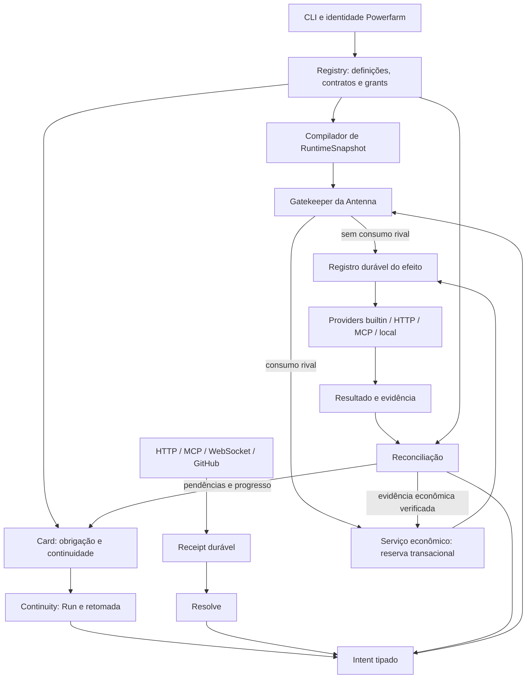

# Antenna: plano de implementação de contratos, Cards e autoridade econômica Powerfarm

Data: 12 de setembro de 2026. Revisão 3: Cards e economia no núcleo; hipótese de Card como instância de software Powerfarm executada pelo Continuity. Estado: plano para execução, sem etapas de implementação declaradas concluídas. A unificação Card/software é uma hipótese de modelagem a verificar, não uma implementação existente declarada.

## 1. Resultado pretendido

A Antenna terá uma URL pública canônica de interação, capaz de receber mensagens assíncronas, chamadas, arquivos e streams. Preservará a entrada, resolverá uma intenção, verificará autoridade e acionará uma capability por um provider. O Registry Powerfarm continuará sendo a fonte de identidade, definições, relações contratuais e autoridade, compilando essas informações para um formato pequeno que a Antenna consegue executar.

GitHub será tanto uma fonte autenticada de observações quanto um serviço de execução de CI/CD. Contratos poderão vincular repositórios, workflows, ambientes e órgãos do ecossistema. O reconciliador existente será preservado e ganhará uma fronteira explícita: observar diferenças e propor ações; a autoridade para executá-las continuará vindo do Registry.

Cards manterão objetivos, obrigações e evidências entre execuções descontínuas. O núcleo econômico registrará alocações, reservas, pagamentos, recebimentos e liquidações atribuíveis a identidade, contrato, Card e Run. A troca de executor preservará compromissos e histórico, obtendo autoridade atual para o próximo Run.

A hipótese principal passa a ser que um Card executável represente uma instância governada do próprio software produzido pela Powerfarm. A definição versionada descreve o programa; a instância mantém estado, contrato e obrigações; cada Run é um episódio de execução. O Continuity é o runtime planejado para essa continuidade. Esta hipótese orienta a auditoria e evita decidir antecipadamente por um subsistema de execução exclusivo de Cards.

**O primeiro ciclo integrado obrigatório será GitHub → Card contratado → gasto autorizado → troca de executor → entrega aceita → liquidação e reconciliação.** A integração de pagamento será provada com provider real em ambiente de testes; um simulador isolado não conclui esse marco. O lançamento de operações monetárias em produção terá seu próprio ensaio limitado na etapa 9.

### Prioridades desta revisão

| Prioridade | Entrega | Justificativa |
| --- | --- | --- |
| 1 | Corrigir admissão, identidade e efeitos duráveis | Nenhuma obrigação ou pagamento pode depender de um aceite perdido ou de autoridade implícita. |
| 2 | Contratos, Cards, retomada e núcleo econômico | Continuidade e compromissos precisam nascer junto ao runtime. |
| 3 | Provar o ciclo integrado de trabalho e economia | Verificar os limites sob falha e troca de executor antes de multiplicar serviços. |
| 4 | Completar a superfície única, Portal, sorter e Realtime contratados | Expandir protocolos sobre a mesma base de autoridade, consumo e evidência. |
| 5 | Generalizar, implantar e ampliar instrumentos econômicos | Escalar após provar conservação, recuperação e liquidação. |

A unificação de transportes pode avançar em paralelo à base contratual/econômica. O portal completo, a emissão de cartões e a extração do reconciliador não bloqueiam a prova integrada. Cartões virtuais, crédito e novos meios de pagamento ampliam capacidades; economia e continuidade por Cards já são parte obrigatória da primeira versão funcional.



O ciclo de invocação é **receber → preservar → resolver → autorizar → reservar quando necessário → registrar a tentativa → executar → observar → reconciliar**. O Card mantém o trabalho entre esses ciclos. Uma ação pode produzir novas evidências e consequências econômicas, sem que receita recebida ou transferência do Card conceda autoridade por si mesma.

## 2. Ponto de partida verificado

Este plano parte do checkout local, incluindo as alterações ainda não commitadas, e não apenas do `main` remoto.

| Componente | Base da inspeção | Consequência para a migração |
| --- | --- | --- |
| Antenna | `powerfarm/antenna`, HEAD `1c9d3641aca5ce0b1d0318d4219de6ae5b119c6b`; alterações locais em `src/lib.rs` e `src/ingress/http.rs` | Preservar o trabalho do endpoint `/` e corrigir sua integração. |
| Processo observado | `bin/antenna`, versão `0.1.0`, ouvindo em `127.0.0.1:8799`; binário igual a `target/release/antenna` na inspeção | Repetir a conferência de binário, configuração e exposição pública no início da execução. |
| Registry | `powerfarm/powerfarm-registry`, commit inspecionado `23007568eaa720067fed3ee7e3dade18a0bf9cf2` | Reutilizar Identity, Manifest, grants e approvals. Avaliar a persistência ADK disponível como candidata de implementação para o Continuity. |
| CLI | Instalação `powerfarm` / `pf` `0.1.1`; o pacote aponta para `powerfarm/powerfarm-cli` | A implementação atravessa três repositórios. A CLI é cliente da mesma autoridade do Registry. |
| Identidade Antenna | App já cadastrado: `9c78de50-e360-4cbd-ac9e-52b65e641be0` | Reutilizar essa identidade. O login humano da CLI não prova que o daemon já tem credencial de serviço apropriada. |
| GitHub | Edge autenticado, recibos, deduplicação, observações e census já implementados | Migrar a cadeia existente; não substituí-la por um webhook genérico sem proveniência. |
| Reconciliação | Materialização determinística de observações em projeções operacionais e planilha | Preservar sua função atual e acrescentar reconciliação contratual sem lhe dar autoridade implícita. |
| Card / responsabilidade | O [protótipo local](/Users/danvoulez/lab/powerfarm-shadow/powerfarm_kernel_v0.py:375), em `commit_responsibility`, exige Card, escopo, satisfação, prazo, capacidade e principal | Usar como referência semântica; auditar a implementação canônica de Cards e o executor antes de decidir o reaproveitamento. O protótipo não comprova um serviço implantado. |
| Programas / Continuity | O [programa de observação](/Users/danvoulez/lab/powerfarm-shadow/pf_isa_observe_v0.program.json) possui identidade, revisão, nós e relações; a [nota de evidência](/Users/danvoulez/lab/powerfarm-shadow/docs/ARCHITECTURE-EVIDENCE-NOTE.md) distingue protótipos e garantias ainda não provadas | Comparar definição, instância de software e Card com o plano Continuity. Não presumir scheduler, recuperação ou promoção já implantados. |
| Economia | Os dois textos de desenho fornecidos definem autoridade conservada, trajetória econômica, Cards e instrumentos financeiros | Na base inspecionada não foi comprovado um serviço econômico operacional. Criar inventário e tratar essa integração como trabalho obrigatório, sem alegar disponibilidade de pagamentos. |

Na inspeção de base, `cargo test --locked --offline` passou com 47 testes. Isso é uma referência de regressão, não uma comprovação do desenho proposto. Os testes do Edge e do Registry e a paridade completa entre migrações locais e Supabase em produção precisam ser verificados na etapa 0.

### Problemas concretos que abrem o trabalho

1. **O `/` ainda não unifica os transportes.** O root recebe HTTP genérico; MCP permanece em `/mcp` e WebSocket em `/ws`. Uma chamada MCP no root pode ser tratada como mensagem para `echo`.
2. **O upload pelo root herda o limite do caminho de eventos.** Na prova isolada, um corpo de 2 MiB recebeu `413` no root, enquanto `/blob` o aceitou. O armazenamento é escolhido por MIME, o que também faz arquivos de texto seguirem outro tratamento.
3. **O envio assíncrono de blob pode criar retorno inexistente.** O código atribui `active-response` mesmo quando não registra um receptor; a prova produziu uma entrega órfã. O timeout de chamada também começa depois de `journey::process`, em vez de limitar toda a espera pela execução.
4. **A fronteira de autorização é insuficiente para um portal dinâmico.** Há decisões baseadas em strings de destino e prefixos. No MCP, o nome indicado no header pode divergir do nome executado a partir do corpo.
5. **Existe uma janela de perda entre execução e entrega.** `journey.rs` conclui run/receipt antes de enfileirar entregas em outra transação. A invocação externa também precisa ter tentativa durável antes do envio.
6. **O sorting não tem um resultado de resolução formal.** As rotas padrão absorvem muito do tráfego; o talent produz uma sugestão, e indisponibilidade ou adiamento podem terminar registrados como execução concluída.
7. **GitHub ainda não é um motor de CI/CD.** `push` é classificado como `repository_activity` com `meaningful = false`, adequado à projeção atual, mas inadequado como filtro global de consumidores.
8. **O código e a documentação operacional precisam ser reconciliados.** O runbook descreve um túnel restrito ao handoff GitHub; a existência do root no binário local não comprova que ele esteja acessível publicamente.

Os principais pontos de intervenção estão em [ingress HTTP](../src/ingress/http.rs), [router HTTP](../src/lib.rs), [MCP](../src/ingress/mcp.rs), [journey](../src/journey.rs), [capabilities](../src/capability/mod.rs), [Gatekeeper](../src/gatekeeper.rs), [observações GitHub](../src/observation.rs), [census](../src/census.rs), [reconciliador](../src/reconcile.rs) e [projeção Sheets](../src/sheet.rs).

## 3. Decisões de arquitetura

### 3.1. Separar os eixos de uma interação

| Eixo | Modelo de destino |
| --- | --- |
| Troca | `submit`, `call`, `stream` |
| Protocolo | HTTP, MCP, WebSocket e outros bindings explicitamente suportados |
| Representação | MIME, encoding e schema quando conhecido |
| Armazenamento | Inline ou objeto; escolhido por tamanho, limites e política |
| Identidade | Principal verificado ou desconhecido; alegações do remetente ficam separadas |
| Vinculação | Binding efetivo ou ausência de vínculo |
| Significado | Capability resolvida, proposta ainda não validada ou resolução pendente |
| Origem | Proveniência verificada, por exemplo GitHub via Edge autenticado |

GitHub é uma origem e um serviço com capacidades; não é um quarto `exchange`. WebSocket é um transporte; uma assinatura Realtime é uma relação de serviço. Um modelo local é uma implementação de provider. Isso mantém operação, mensagem e binding separados, seguindo a disciplina conceitual de [AsyncAPI 3](https://www.asyncapi.com/docs/reference/specification/v3.0.0).

O desconhecido pode ser admitido e preservado sob limites explícitos. Não pode causar um efeito privilegiado sem resolução e autoridade. Limites de admissão também se aplicam a entradas anônimas; abertura semântica não significa armazenamento ilimitado.

### 3.2. Uma superfície pública de interação

| Requisição na URL canônica `/` | Comportamento de destino |
| --- | --- |
| `POST`, HTTP genérico | Preservar; por padrão responder `202` com referência do receipt e forma autorizada de consultar o resultado. |
| `POST`, chamada explícita | Resolver deterministicamente, autorizar e executar com deadline. Esperar conforme política e preferência aceita. |
| `POST`, MCP | Validar a versão e o envelope MCP, autenticar e despachar pelo protocolo. |
| `POST`, webhook GitHub | Validar proveniência/assinatura no Edge e handoff; preservar e responder sem esperar CI/CD. |
| `GET`, upgrade WebSocket | Negociar subprotocolo, identidade e limites; estabelecer conexão. |
| `GET`, SSE de aplicação | Assinar feed autorizado, com cursor e política de retomada próprios. |
| `GET`, HTML | Interface humana. |

O demultiplexador é determinístico e tem precedência documentada. Headers são indícios de protocolo, não identidade nem permissão. Header e corpo MCP precisam concordar; um envelope de protocolo inválido recebe erro apropriado, sem cair em outro caminho para contornar validação.

SSE é uma forma de entregar eventos e pode também aparecer na resposta de um transporte MCP que a versão negociada permita. Não é necessário criar `/sse` como uma arquitetura separada. A matriz de métodos e respostas MCP será implementada conforme a versão escolhida, sem confundir um feed SSE de aplicação com o transporte MCP. A [migração MCP 2026-07-28](https://blog.modelcontextprotocol.io/posts/2026-07-28/) remove a sessão de transporte e o handshake antigo; o código atual precisa passar por conformidade, não apenas mudar o nome da versão.

`Prefer: respond-async` e `Prefer: wait=N` serão preferências negociadas; `Preference-Applied` indicará o que foi atendido. Não constituem promessa de conclusão no prazo. `202` só será emitido depois da persistência exigida pela Antenna, sem significar que o efeito terminou. Referências: [RFC 7240](https://www.rfc-editor.org/rfc/rfc7240.html) e [RFC 9110](https://www.rfc-editor.org/rfc/rfc9110.html).

Aceite, primeiro resultado e conclusão têm prazos distintos. MCP/RPC e streams precisam de despacho e resposta de protocolo dentro de seu orçamento, mas a operação chamada pode ser longa. Ela só vira trabalho assíncrono mediante uma semântica que o cliente suporte; não será enviada silenciosamente à fila de sorting. Metas de latência serão medidas e publicadas por serviço, sem prometer resposta instantânea para execução externa.

Rotas de saúde, inspeção autorizada, OAuth e discovery de autenticação são superfícies operacionais ou de controle. Podem existir além de `/`. `/ingress`, `/blob`, `/mcp`, `/ws` e o callback GitHub atual serão aliases durante a migração, com retirada baseada no uso real. O handoff interno do Edge pode continuar privado; não é uma segunda API pública de interação.

O contexto de conexão guarda em memória protocolo, principal, binding, revisão e limites ativos. Handles de operação e cursores ficam explícitos quando o cliente precisar retomá-los. Estado durável de um workflow pertence ao runtime de aplicação; feeds recuperáveis precisam de log durável. Não criar sessões universais no Postgres para representar toda conexão WebSocket, Realtime ou MCP.

### 3.3. Fronteiras de responsabilidade

| Componente | Responsabilidade e fonte de verdade |
| --- | --- |
| Registry / Supabase | Identidades, definições versionadas de programa/serviço, contratos, grants, revogações e referências de instâncias, Cards e execuções. Definir a custódia dos estados com o Continuity e reutilizar armazenamento canônico existente; não duplicar a mesma instância em dois sistemas. |
| Compilador do Registry | Produzir autoridade efetiva e bindings executáveis, com versão e validade. |
| Serviço econômico do Registry | Alocações, disponibilidade reservável, compromissos, journal econômico e evidência de liquidação. Começa como módulo transacional no mesmo Registry/Supabase. |
| Antenna | Bytes recebidos, receipts, resolução, autorização de invocação, tentativas, entregas e evidência local durável. |
| Continuity — runtime planejado | Executar instâncias de software governadas, preservar checkpoints, dormir/despertar e retomar com executor compatível. Engine, Gadgets e ADK são candidatos de implementação a avaliar, não substitutos presumidos do desenho Continuity. |
| Providers | Executar operações de um protocolo, usando credenciais referenciadas e autoridade concedida. |
| Reconciliador | Comparar objetivo, compromisso e estado observado; produzir projeções ou propostas de Intent e reconciliar pagamentos incertos sem lhes dar replay cego. |
| Program Graph / definição executável | Programa versionado e admitido, com operações e dependências; suas revisões seguem validação/promoção e não são alteradas por mera observação. |
| Grafo de contexto / evidências | Relações, custos observados e evidências para decisão; não é o contador transacional de orçamento nem concede autoridade. Distinguir essa projeção da definição executável do programa. |
| GitHub e infraestrutura | Estado externo observado de commits, Actions, checks, artefatos e deployments. |
| Sheets | Projeção operacional derivada; não concede autoridade e não substitui o Registry. |

`repository_registry`, no SQLite atual, é uma projeção do GitHub, não o Powerfarm Registry. Seus identificadores e evidências serão preservados, mesmo se uma nomenclatura mais clara for introduzida por views ou APIs.

## 4. Modelos mínimos e invariantes

### Receipt, Intent e execução

- **Receipt:** entrada imutável, proveniência, digest com algoritmo explícito, referência do corpo e correlação. Resoluções e estados de execução são registros derivados. Uma migração não deve recalcular ou reinterpretar silenciosamente evidência histórica.
- **Resolution:** `resolved`, `deferred` ou `rejected`, com motivo e proveniência. Ordem: operação explícita → binding → regra determinística → sorter contratado → adiamento.
- **Intent:** capability e versão/schema, argumentos validados, recurso, receipt, binding, solicitante verificado, executor e eventual delegação; referências de Card, Run, objetivo e quote quando aplicáveis. O remetente não escolhe unilateralmente sua identidade nem seu poder de execução.
- **Granted / Denied:** decisão tipada com revisão de autoridade, restrições e referências de base. Uma decisão permite apenas a operação e o recurso examinados.
- **Run / Effect:** tentativa registrada antes do envio externo, idempotência por escopo e request hash, resultado confirmado ou estado `uncertain`. Um timeout não prova que o efeito não aconteceu.
- **ReturnPath:** handle tipado, vinculado ao receipt, principal e conexão apropriados. Correlação fornecida pelo cliente não é uma credencial e não pode capturar a resposta de outro cliente.

Não há garantia universal de efeito externo exatamente uma vez. A promessa é preservar a intenção e a tentativa, deduplicar quando possível e reconciliar ambiguidade antes de repetir operações não idempotentes.

O direito da Antenna de chamar `semantic.resolve` autoriza esse processamento interno. Ele não transfere ao remetente desconhecido os grants da Antenna. A proposta devolvida pelo sorter mantém o solicitante e a proveniência originais e passa por outra decisão de autoridade para a operação sugerida.

### CapabilityDescriptor e Provider

O descriptor contém identificação, descrição, schema de entrada/saída, exchanges suportados, revisão e referência do provider. O provider implementa chamada, eventos de progresso quando suportados, cancelamento, deadline e normalização de erros.

Os primeiros mecanismos serão `BuiltinProvider`, `HttpProvider`, `McpProvider` e `LocalProvider`. Um serviço novo pode ser configurado por definição e schema. HTTP genérico não descobre sozinho a semântica de qualquer API: operações precisam de um mapeamento declarativo ou de uma fachada de serviço já existente.

A validação HMAC do GitHub, a obtenção de token de instalação e a extração de campos próprios de seus eventos continuam legítimas. Esse conhecimento fica no binding de origem ou serviço GitHub, fora do algoritmo central de resolução e autoridade. Não haverá um provider obrigatório para cada fornecedor.

### Contratos e compilação

Modelos de contrato e definições de serviço usarão `artifacts` + `artifact_versions`. Os tipos de artefato hoje permitidos precisam ser respeitados, usando uma categoria existente adequada ou uma migração explícita se ela se mostrar necessária. Publicação imutável precisa ser garantida pelo código e banco, não apenas por comentários.

As duas relações contratuais centrais são:

- `contracts`: referência à versão exata do modelo, termos canônicos, hash do conteúdo aceito, ciclo de vida, validade e autoria.
- `contract_parties`: identidade, papel e evidência de aceitação do mesmo hash, com chave e assinatura quando exigidas pelo modelo de identidade.

Mudança nos termos aceitos gera nova revisão ou instância e nova aceitação; não altera retrospectivamente um contrato firmado. A ativação exige participantes necessários, grants válidos e definições disponíveis. Aceitar um contrato não permite ao signatário conceder poderes que não possui. Revogação ou suspensão interrompe a autoridade derivada segundo a política publicada.

O histórico de decisões e transições deve ser append-only, reutilizando a infraestrutura de auditoria aplicável. Não criar famílias de tabelas por protocolo. `run_grants` de Gadgets permanecem vinculados à revisão exata do Gadget; não serão reutilizados indiscriminadamente como contratos de serviço.

Um contrato de trabalho ou serviço pago também define financiador, prestador/beneficiário, escopo, evidência exigida, procedimento de aceitação, preço ou fórmula versionada, limites e tratamento de entrega parcial, falha, cancelamento e contestação. A condição de pagamento precisa indicar quem pode atestar cumprimento e quando nasce a obrigação. A apresentação de evidência pelo executor não o autoriza a aprovar a própria remuneração; a regra de aceitação é explícita e verificável.

Formato lógico de destino, ainda não uma API existente:

```text
RuntimeSnapshot
  schema_version, compiler_version
  audience = identidade Antenna
  revision, issued_at, expires_at, content_hash
  providers[], capabilities[], bindings[]
  effective_authority[], revocation_revision
  signature + signing_key_reference

RuntimeBinding
  id, subject, provider_ref
  capabilities + revisions, resources, exchanges
  constraints tipadas, valid_from, valid_until
  work_policy_ref?, economic_policy_ref?, budget_scope_ref?
  basis = referências e hashes de contratos/grants
```

A linguagem de restrições é fechada e versionada: operação/recurso, tamanho, prazo, timeout, limites locais e referências de reservas compartilhadas. Restrição desconhecida impede compilação ou aplicação do snapshot. A Antenna não interpreta termos livres nem templates.

O snapshot é obtido de uma API autenticada do Registry, com ETag e polling inicialmente. A Antenna valida emissor, audiência, assinatura, revisão, compatibilidade e validade antes de trocar atomicamente o conjunto. Segredos não entram no snapshot; entram referências ao mecanismo autorizado de credenciais. Isso aplica a separação entre plano de controle e execução, sem exigir instalar Envoy ou implementar xDS; a [documentação de configuração dinâmica do Envoy](https://www.envoyproxy.io/docs/envoy/latest/intro/arch_overview/operations/dynamic_configuration) fundamenta essa evolução incremental.

Cada decisão registra sua revisão. Antes de um efeito sensível, a autoridade é revalidada. Conexões abertas também obedecem à expiração e revogação; cada contrato define se uma atualização interrompe a operação ou permite um trecho já autorizado. O último snapshot válido pode servir até seu vencimento. Depois disso, novos efeitos privilegiados param; recepção restrita pode continuar. Revogação por polling tem uma janela máxima explícita; requisitos mais estritos usam verificação online ou leases curtos.

Limites compartilhados — concorrência global, orçamento, vaga de deploy e dinheiro — exigem reserva atômica. Um contador local ou um snapshot não resolve disputa entre instâncias. Reservas terão escopo, validade, idempotência, fencing quando necessário e reconciliação após falhas.

### Card: hipótese de instância governada de software

Hipótese a validar na etapa 0 e concretizar na etapa 3: reutilizar a unidade de software que a Powerfarm produz e o Continuity planeja executar para realizar Cards. A hipótese separa três níveis, sem exigir uma nova entidade institucional para cada um:

| Nível | Função |
| --- | --- |
| Definição de programa | Artefato imutável e versionado: lógica/grafo, schemas, capacidades exigidas e compatibilidade de execução. Pode ser reutilizado por várias instâncias. |
| Instância de software / Card executável | Identidade estável da instância, inputs, estado, objetivo e obrigações contratuais. O Card pode ser essa instância ou sua representação de trabalho; a auditoria fixa o mapeamento sem criar dois estados canônicos. |
| Run | Episódio de execução da instância no Continuity, com executor, revisão do programa, contexto e autoridade atuais. |

O Card continua delimitando trabalho e responsabilidade. Sua realização executável pode usar um programa existente parametrizado; abrir um Card não exige gerar código novo nem executar uma nova etapa de LLM. Se o trabalho exigir produzir outro programa, a definição candidata passa por validação e promoção antes de poder ser executada com efeitos. Publicar código não concede grants.

```text
Powerfarm produz/seleciona uma definição de programa
  → Registry registra versão e promoção autorizada
  → contrato vincula uma instância / Card
  → Continuity executa Runs e mantém continuidade
  → Antenna admite entradas e invoca capabilities autorizadas
  → evidência e economia permanecem ligadas à instância
```

Não se declara que todos os produtos Powerfarm já sejam Cards ou que o Continuity esteja pronto. A etapa 0 deve localizar as fronteiras canônicas entre Cards/compromissos, Program Graph e realização do runtime, comparando também os conceitos existentes de Gadget/revisão/instalação. O resultado será um mapeamento explícito e o menor perfil do Continuity necessário ao piloto, com garantias verificáveis. A infraestrutura completa de continuidade pode evoluir sem alterar a identidade da instância.

### Continuidade de trabalho, identidade e autoridade

O Card é a unidade durável de trabalho vinculada a uma ou mais obrigações contratuais. Não substitui Identity, Contract ou Grant. Nem todo Receipt cria um Card: chamadas imediatas podem terminar em um Run; trabalho que precisa atravessar esperas, handoffs ou condições de satisfação usa o Card existente ou cria um por operação autorizada.

Modelo lógico, a mapear ao sistema canônico auditado:

```text
Card
  id, revision, owner_identity, contract_refs
  program_ref + immutable_program_revision, instance_ref
  objective + scope + satisfaction_policy_ref
  evidence_refs, graph_refs, parent_card_ref?
  required_capabilities, deadline, wake_after / wake_on
  execution_refs, checkpoint_ref, assignment_epoch
  authority_basis_refs, economic_scope_refs
  work_state, acceptance_refs, pending_obligation_refs
```

`instance_ref` pode ser o próprio ID do Card se o mapeamento adotado unificar os dois. Para trabalho ainda não executável, a vinculação a programa pode estar pendente, explicitamente; nenhum Run com efeitos começa sem uma revisão executável admitida. IDs institucionais já existentes não são renomeados para acomodar essa hipótese.

Objetivo e critérios aceitos são versionados. Progresso e handoff não mudam silenciosamente o contrato. Valores como saldo disponível ou preço observado são projeções datadas; ao reservar ou aceitar um preço, o serviço competente consulta e valida o estado atual.

Cada Run identifica o executor e a identidade responsável, fixa a revisão de trabalho e recebe autoridade válida naquele momento. Assumir um Card exige aceite de responsabilidade delimitada e claim exclusivo por unidade de trabalho, com geração/lease e fencing nas operações que o suportem. Cards com trabalho paralelo usam atribuições explícitas por subtrabalho, sem um claim global fictício.

Trocar o modelo ou o host não implica trocar o programa. Atualizar o programa é outra operação: exige revisão admitida, compatibilidade ou migração explícita de estado e preservação de obrigações/comandos existentes. Na retomada, o Continuity valida programa, schema do checkpoint, atribuição e autoridade. A instância não muda de identidade para ocultar um pagamento ou deployment pendente.

Ao dormir ou falhar, o executor deixa checkpoint e referências de tentativas pendentes. O sucessor retoma esse estado, verifica efeitos incertos e obtém novos grants/bindings quando necessários. Não herda segredos, tokens ou permissões expiradas. O fim de um lease impede novos atos do executor antigo; não prova que um ato externo já enviado deixou de existir.

Conclusão do trabalho e conclusão econômica são estados separados. Um Card pode ter entrega aceita e liquidação pendente, ou trabalho cancelado e devolução devida. Obrigações existentes continuam atribuíveis ao principal, Card e Run de origem após expiração do grant ou troca do modelo.

### Núcleo econômico: autoridade, compromisso e valor

O módulo econômico fica atrás da API do Registry, usando sua identidade e autorização. A Antenna valida autoridade compilada e pede uma reserva transacional; não interpreta termos financeiros livres nem mantém um saldo concorrente em SQLite. A operação de reserva valida os fatos sensíveis atuais e é o ponto de decisão sobre disponibilidade. Um snapshot pode anunciar o teto e a política, mas não certificar que aquele valor ainda está livre.

| Registro | Significado e regra |
| --- | --- |
| Grant | Direito limitado de agir; não contém `spent_so_far` ou um saldo editável. |
| Alocação de orçamento | Parcela de uma fonte disponível para um escopo, com linhagem de delegação. Autorizações que compartilham uma fonte disputam a mesma disponibilidade. |
| Quote | Preço/fórmula e limite aceitos para uma operação, com ativo, validade, contraparte, recurso e hash dos argumentos relevantes. |
| PaymentIntent | Intenção econômica identificada e idempotente, ligada a contrato, operação, Card/Run quando aplicável, fonte, contraparte e limite. |
| Reserva / compromisso | Valor ou capacidade indisponível para outro consumo enquanto a obrigação estiver aberta. |
| Journal econômico | Lançamentos imutáveis e balanceados por ativo para valores contabilizados; correções por contralançamentos e evidência. |
| Liquidação | Movimento externo verificado, com referências do provider, quantias efetivas e estado de confirmação/reversão. |

O journal de partidas dobradas entra desde a primeira implementação econômica, pois o desenho já contempla recompensas e alocações entre participantes. Ele pode ser pequeno: contas com titular definido, transações, lançamentos e referências de origem. Orçamentos e reservas mantêm suas próprias invariantes; receber um grant não é lançamento de receita ou depósito. Modelos físicos de tabelas serão fechados após a auditoria do schema, preservando essas responsabilidades.

Regras obrigatórias:

1. **Conservação por fonte e unidade.** Delegar orçamento compromete a disponibilidade correspondente na origem; grants sobrepostos não multiplicam recursos. Dois Runs que tentam reservar acima da disponibilidade não podem ambos ter sucesso. Saldos materializados são atualizados atomicamente com os registros que os sustentam e podem ser reconstruídos.
2. **Unidades exatas.** Quantias usam inteiros na menor unidade ou decimais de precisão definida, nunca float binário. EUR, USDC e créditos internos são ativos distintos. Câmbio, taxas e custos máximos têm política e evidência próprias; uma cotação não cria equivalência permanente entre unidades.
3. **Sem dupla contagem.** Capturar uma reserva move valor entre estados; não debita reserva e liquidação duas vezes. Recebimento, alocação interna, custo estimado, obrigação e receita reconhecida permanecem distinguíveis. Reembolso só recompõe autoridade de gasto se a política permitir.
4. **Compromisso antes de envio.** Reserva, PaymentIntent e comando durável de execução são gravados em uma transação do serviço econômico. A Antenna registra sua tentativa local antes do provider. IDs estáveis e request hashes ligam os dois journals; não há suposição de transação distribuída com o provider. Um despacho retomado consulta o comando existente em vez de criar outra cobrança.
5. **Incerteza conserva exposição.** Falha comprovadamente anterior ao envio pode liberar a reserva. Após envio possível, estado `uncertain` exige reconciliação. Expiração de grant, Card ou lease não libera automaticamente a exposição nem cancela uma obrigação externa.
6. **Revogação impede novos compromissos.** Obrigações já assumidas continuam registradas; cancelamento, devolução e liquidação seguem sua política e autoridade de recuperação. Uma resposta externa tardia não pode ser apagada para fazer o teto parecer respeitado.
7. **Ganhar não concede poder.** Recebimento alimenta o estado econômico. Reinvestimento exige decisão autorizada que emita ou ajuste uma alocação/grant com limites e linhagem; o executor não cria sua própria autoridade.
8. **Aceitação e pagamento independentes.** Entrega é julgada pelo procedimento contratado. Liquidação é verificada pelo mecanismo econômico/provider. Recibos externos duplicados, contestados ou ainda não confirmados não viram automaticamente receita disponível ou nova remuneração.

Fluxo de compra de capability:

```text
Intent de trabalho + quote/política aceita
  → autoridade atual
  → reserva atômica + PaymentIntent + comando durável
  → tentativa registrada → provider
  → evidência verificada → liquidação/reconciliação
  → trabalho continua ou fica pendente com causa explícita
```

Fluxo de venda: requisição → preço/condição aceita → cobrança ou autorização de pagamento conforme contrato → execução autorizada → evidência de entrega → captura/liquidação/devolução conforme resultado. Prepagamento e cobrança após entrega são políticas explícitas. Uma prova de pagamento vincula-se ao pedido e não pode ser reaproveitada para obter outro serviço. Um desafio `402` do upstream propõe uma compra, sem autorizar por si só o gasto ou a contraparte.

Tarifa fixa é o primeiro caso. O mesmo modelo comportará consumo medido e assinaturas: reservar blocos limitados, registrar consumo e obter nova reserva antes de excedê-los. Em streams, o bloco precisa ser curto o suficiente para cumprir a política de revogação. Não consultar Supabase por token/frame, nem continuar consumindo indefinidamente com uma fotografia antiga do orçamento.

### Obrigações, instrumentos e expansão econômica

Card Powerfarm continua significando trabalho durável. Cartão de pagamento é um instrumento oferecido por provider, subordinado a um binding e a recursos financeiros identificados. Antes de habilitar um instrumento, mapear suas garantias reais: autorização, captura parcial/tardia, taxas, estorno, devolução, moeda e timeout. A compilação rejeita exigência de limite estrito que aquele provider não consegue cumprir, ou exige uma política explicitamente aceita para a exposição residual.

Como referência concreta, os controles de gastos da Stripe têm agregação de melhor esforço, podem atrasar até 30 segundos e não impedem todo excedente posterior. Autorizações síncronas têm uma janela de dois segundos antes da política de timeout. Esses comportamentos precisam de binding determinístico e tratamento de exposição, não de sorting por LLM. Fontes: [controles de gastos](https://docs.stripe.com/issuing/controls/spending-controls) e [autorizações em tempo real](https://docs.stripe.com/issuing/controls/real-time-authorizations).

| Entra na base obrigatória | Expansão sobre a base comprovada |
| --- | --- |
| Alocação, reserva, compra, cobrança, remuneração condicionada, devolução e reconciliação | Cartões virtuais, múltiplos meios de pagamento e múltiplas moedas |
| Continuidade de obrigações e limites entre executores | Crédito com credor, responsável devedor, restituição e inadimplência explícitos |
| Distinção entre receita, orçamento, custo e transferência interna | Bids, mercado de trabalho/capacidade e políticas de poupança/investimento |
| Linhagem de autoridade e teste de reinvestimento limitado | Reinvestimento mais elaborado e crédito precificado por evidências |

O schema deve poder referenciar obrigações a pagar/receber e a origem de uma alocação. Crédito futuro será um contrato com responsabilidade e contabilização próprias; redistribuir orçamento não cria por si um empréstimo. Créditos internos terão unidade e regras de emissão/resgate explícitas, sem serem apresentados como euros. O primeiro provider é escolhido pelas capacidades verificadas no inventário, sem depender de funcionalidades anunciadas como futuras; a documentação consultada da [Cloudflare Wallets](https://developers.cloudflare.com/wallets/) ainda distingue reserva de handles de movimentação de fundos.

## 5. GitHub como base de CI/CD contratual

### Preservar e evoluir o caminho existente

Hoje o Edge verifica a assinatura GitHub sobre os bytes originais e autentica o handoff para a Antenna. O aceite durável cria receipt, liga a entrega à observação e atualiza a projeção local. O census recupera uma visão do conjunto de repositórios; a reconciliação alimenta a projeção operacional.

A evolução mantém esse caminho e adiciona consumidores independentes:

```text
GitHub webhook ou census
  → proveniência verificada
  → Receipt + Observation duráveis
  ├─ projeção operacional existente → Sheets
  └─ regra de contrato CI/CD
       → Card / obrigação e orçamento vinculados
       → proposta de execução por Run
       → Gatekeeper
       → reserva de capacidade/custo quando aplicável
       → workflow durável, quando necessário
       → Provider → GitHub Actions / serviço de deployment
       → resultado, checks e evidência do ambiente
       → aceitação contratual da entrega
       → remuneração / liquidação quando prevista
       → reconciliação → Card, Registry e projeções
```

O webhook confirma recepção sem esperar build ou deploy. GitHub recomenda resposta em até dez segundos e mantém o delivery ID em redelivery; a implementação deve suportar reentrega e recuperação de eventos perdidos. O Edge atual só confirma após o upstream persistir: testar esse orçamento e, se necessário, introduzir fila durável no Edge com uma promessa explícita de entrega, nunca antecipar sucesso sem armazenamento. Fonte: [boas práticas de webhooks GitHub](https://docs.github.com/en/webhooks/using-webhooks/best-practices-for-using-webhooks).

### O que um contrato CI/CD estabelece

| Parte do contrato | Conteúdo executável |
| --- | --- |
| Partes | Identidade responsável pelo projeto, serviço de execução, serviço de deployment e observação/reconciliação conforme os papéis necessários. |
| Origem permitida | GitHub App/instalação, ID estável do repositório, eventos, ações e política de refs. |
| Código e workflow | Revisão da definição, commit de origem exato e workflow autorizado. |
| Destino | Ambiente e recurso de deployment identificados no Registry. |
| Condições | Checks no commit correto, política para forks, evidência do artefato e aprovações somente quando o contrato exigir. |
| Poderes | Capabilities específicas para iniciar, observar, publicar resultado, promover, cancelar ou reverter. |
| Limites | Timeout, concorrência por projeto/ambiente, orçamento, frequência e política de retry. |
| Trabalho durável | Card, escopo, critério de satisfação, atribuições, prazo e política de retomada por outro executor. |
| Economia | Fonte de orçamento, custos permitidos, quotes, limite por execução, eventual recompensa, financiador/beneficiário e condição de pagamento/devolução. |
| Evidência | Receipt, Card/Run, revisão contratual, decisão de autoridade, reserva, run externo, commit, digest do artefato, aceitação e liquidação. |

Nomes como `ci.start`, `ci.observe`, `deployment.promote` e `deployment.rollback` são propostas de catálogo, não comandos ou permissões já implementados. O grant existente `ci.report` não implica poder de disparar builds ou implantar software.

A parte prestadora pode ser a identidade Powerfarm que opera a instalação GitHub e oferece suas capacidades. Isso não pressupõe que a empresa GitHub assine um contrato Powerfarm. A instalação, os repositórios e os workflows são recursos vinculados ao serviço, com permissões externas verificadas além dos grants internos.

O primeiro piloto será um único repositório e um ambiente não produtivo escolhidos dentre os cadastros existentes, com uma capability paga e remuneração condicionada à entrega, usando integração de provider em sandbox. Ele inclui interrupção e retomada por outro executor e comprova saída e entrada econômica. Depois da prova completa, a mesma definição de serviço e o mesmo modelo contratual devem atender a um segundo projeto sem alterações no core da Antenna.

### Regras essenciais de execução

1. **Uma observação não é uma autorização.** Um `push`, tag ou workflow concluído não muda contratos, grants, pertencimento institucional ou destino de produção.
2. **Relevância pertence ao consumidor.** `push` pode não alterar a planilha e ainda disparar CI. Consumidores terão cursores e deduplicação próprios; a marca global `reconciled` não pode fazer um consumir o evento do outro.
3. **Cada execução fixa sua proveniência.** Usar ID estável do repositório, commit, workflow, versão contratual, ambiente e geração desejada. Renomear um repositório não cria outro projeto.
4. **Uma aceitação da API não conclui o workflow.** O provider registra o identificador retornado quando disponível e acompanha o resultado. Fixar a versão da API GitHub usada; a documentação atual de dispatch aceita `ref` como branch ou tag, portanto a implementação também deve transportar e verificar o commit de origem exato. Fonte: [workflow dispatch](https://docs.github.com/en/rest/actions/workflows#create-a-workflow-dispatch-event).
5. **Build e promoção são decisões distintas.** A conclusão deve corresponder ao run, commit e artefato esperados; sucesso de um build antigo não promove uma geração mais nova. Revalidar autoridade antes de publicar ou promover.
6. **Código de forks tem escopo restrito.** Concluir um workflow sem privilégios não lhe transfere segredos de deploy. `workflow_run` pode iniciar um workflow com permissões superiores; a política deve validar proveniência e evitar executar artefatos não confiáveis com essas credenciais. Fonte: [eventos de workflows GitHub](https://docs.github.com/en/actions/reference/workflows-and-actions/events-that-trigger-workflows#workflow_run).
7. **Não confundir evento atrasado com estado atual.** Correlacionar por run e geração e consultar estado externo quando necessário. Census incompleto não remove repositórios nem suspende projetos automaticamente.
8. **Evitar duplicação e ciclos.** Deduplicar por regra contratual, origem e geração; redelivery não gera outro deploy. Distinguir reexecução explicitamente autorizada de retry de transporte. Eventos produzidos pelo próprio CI não podem realimentar indefinidamente seu disparo.
9. **Deployment precisa de observação.** Criar um registro de deployment ou receber aceite do provider não comprova que o ambiente está saudável. Conclusão exige a evidência contratada; reversão é outro efeito autorizado.
10. **Autodeploy exige recuperação independente.** Antenna e Registry poderão participar do mesmo CI/CD, mas a promoção deve preservar um caminho de recuperação fora do processo que está sendo substituído.
11. **Trabalho e liquidação continuam entre Runs.** O executor substituto retoma o Card e o compromisso existente. Um pagamento incerto não é refeito para permitir que o CI continue; o estado pendente e sua evidência fazem parte do handoff.
12. **Aceitação dispara apenas a consequência contratada.** Um check ou aprovação de entrega não aumenta o orçamento do executor. Recompensa, taxas e reinvestimento seguem operações econômicas distintas, com limites, responsáveis e evidências verificáveis.

## 6. Decisão sobre o reconciliador

**Manter inicialmente no mesmo processo, com interface de serviço isolada desde a refatoração.** Não criar agora um segundo daemon apenas para deslocar o código existente.

Haverá três funções explícitas, com cursores e responsabilidades separados:

- **Materializar observações:** continuar a produzir o estado operacional derivado de GitHub e census, incluindo a projeção da planilha.
- **Reconciliar um objetivo contratado:** comparar uma geração desejada autorizada com evidências de execução e deployment; produzir no-op, necessidade de observação ou uma proposta de Intent.
- **Reconciliar compromissos econômicos:** comparar reservas e comandos com respostas, transações e extratos do provider; identificar captura, liquidação, devolução, contestação ou incerteza e apresentar evidência à operação econômica autorizada.

O reconciliador não altera unilateralmente o objetivo desejado. Continuam protegidos `Target`, princípio, autoridade e pertencimento institucional. Ele não invoca providers por um atalho nem recupera poderes de uma execução antiga quando o contrato foi revogado.

Interface lógica: entradas são observações com cursor, objetivo versionado e contexto efetivo de binding; saídas são projeções, propostas com chave idempotente e um checkpoint. Eventos repetidos e replay devem produzir o mesmo resultado lógico. A inclusão de timestamps ou IDs de execução não deve causar diferenças artificiais e reescritas sem mudança de estado.

O reconciliador não movimenta lançamentos por acesso direto ao banco: a API econômica valida e registra cada transição. Julgar satisfação do trabalho segue o procedimento do contrato; verificar liquidação segue a evidência financeira. A conclusão de um desses processos não conclui implicitamente o outro. Recuperação financeira pode continuar após o Card terminar, sob autoridade própria de observação e regularização.

**Extrair para um órgão independente quando houver necessidade demonstrada:** vários consumidores fora da Antenna, escala própria, disponibilidade distinta ou ciclo de implantação independente. Na extração:

1. Procurar cadastro existente e, se necessário, registrar a identidade do órgão pela Powerfarm CLI/Registry.
2. Firmar o contrato de reconciliação e grants mínimos; migrar explicitamente o executor das obrigações.
3. Consumir evidências por API/feed durável com cursor, sem compartilhar o arquivo SQLite entre processos.
4. Transferir checkpoints e responsabilidade por partição com lease/fencing, impedindo dois executores ativos sobre o mesmo objetivo.
5. Manter a Antenna como entrada e guardiã de invocações, e o Registry como autoridade e fonte do objetivo.

Essa extração é uma opção de implantação do mesmo desenho, não um requisito para concluir a arquitetura funcional.

## 7. Sequência de implementação

Cada etapa resulta em alterações revisáveis, testes de suas invariantes e uma forma de retorno. Etapas que envolvem vários repositórios terão PRs coordenados e compatibilidade entre versões. A numeração indica a prioridade de integração; dependências explicitadas permitem trabalho independente.

O caminho prioritário é **0 → 1 → 2 → 3 → 4 → 5**: base, admissão, execução autorizada, contratos/Cards, núcleo econômico e prova integrada. O desenvolvimento dos transportes da etapa 6 pode avançar após 2; a expansão do portal da etapa 7 integra a base já comprovada. A extração de órgãos e instrumentos financeiros adicionais não antecede a prova.

### Etapa 0 — Congelar a base e localizar os sistemas canônicos

**Escopo:** Antenna, Edge, Registry, CLI, Cards, executor e operação.

- Registrar commits, diff local, digest do binário, versão da CLI, configuração sem segredos e topologia real de portas, Edge e túnel.
- Preservar o trabalho local e criar fixtures sanitizadas de receipts, GitHub, census e projeções. Fazer backup consistente de SQLite/objetos e provar restauração isolada.
- Reexecutar a baseline Rust e os checks/testes existentes do Edge. Conferir as migrações do Registry contra o banco remoto e recuperar fontes ausentes antes de criar schema.
- Localizar o plano e as realizações do Continuity, Cards/compromissos, definições Program Graph e seus armazenamentos/escritores. Mapear programa → instância/Card → Run e comparar Gadgets/revisões/instalações antes de definir tabelas ou outro executor.
- Definir o perfil mínimo do Continuity para o piloto: programa admitido, estado durável, wake por evento/prazo, retomada e integração de autoridade/efeitos. Auditar Engine/ADK como candidatos de implementação; persistência existente não comprova scheduler ou recuperação operacionais.
- Inventariar identidades, contas/fontes econômicas e providers já disponíveis. Escolher integração de teste que comprove gasto e recebimento, explicitando APIs, ativo, credenciais de serviço, estados, limites e capacidade de consulta/reconciliação.
- Verificar a credencial de serviço da identidade Antenna, autenticação de clientes MCP e titularidade das contas econômicas. Não criar cadastros concorrentes por falta de inventário.

**Concluída quando:** source, binário e exposição estão identificados; restauração funciona; o mapeamento Card/software e o perfil mínimo Continuity estão definidos, com lacunas e componentes candidatos explícitos; há um caminho de integração econômica verificável. Ausência de credencial/provider bloqueia sua prova externa, sem impedir o desenvolvimento isolado; não pode ser resolvida declarando o simulador como integração concluída.

**Retorno:** nenhuma alteração de comportamento. Preservar binário, configuração e referências de dados usados como base.

### Etapa 1 — Corrigir o root e a durabilidade de admissão

**Depende de:** 0. **Escopo principal:** ingress HTTP, receipt, storage, jornada e migrações SQLite.

- Extrair captura comum do corpo com leitura incremental, limites, spool por tamanho/política e limpeza de staging.
- Corrigir o limite de upload do root, a seleção de armazenamento por MIME e o retorno órfão de submissões assíncronas.
- Introduzir `exchange` e algoritmo de digest de forma aditiva. Preservar `interaction`, bytes e leitores históricos; modalidade desconhecida de um blob antigo não recebe inferência silenciosa.
- Tornar receipt e trabalho pendente recuperável uma unidade durável. Separar deadline de upload, espera pela execução e continuidade após desconexão.
- Retornar acompanhamento autorizado em `202`. Acrescentar correlação capaz de ligar posteriormente Card, Run e efeitos, sem transformar toda mensagem em Card.

**Concluída quando:** formatos e tamanhos distintos seguem a mesma política; async não gera retorno órfão; crash não perde trabalho aceito; restauração preserva os digests SHA-256 do GitHub e BLAKE3 dos caminhos genéricos.

**Retorno:** manter aliases e compatibilidade de leitura/escrita até provar que a versão anterior abre o banco expandido. Não editar migração aplicada nem apagar novos registros para forçar downgrade.

### Etapa 2 — Identidade, efeitos e interfaces de execução

**Depende de:** 1. **Escopo principal:** Gatekeeper, ReturnPath, jornada, outbox, capability, router e identidade.

- Autenticar pelo mecanismo Powerfarm; separar principal verificado, alegação do remetente, executor e delegação. Provisionar o daemon sem uma sessão humana permanente.
- Introduzir Intent e decisão tipados, com revisão de autoridade e referências opcionais de Card/Run. Usar inicialmente snapshot estático validado e derivado da autoridade existente.
- Remover permissões implícitas de prefixos; vincular respostas ao receipt/principal correto; validar coerência de header e corpo MCP.
- Registrar tentativa antes de efeito externo, com idempotência por escopo e request hash. Fazer transições locais relacionadas atomicamente; recuperar estados incertos sem repetição cega. Migrar o protocolo de efeitos preservando os journals de entrega e Sheets.
- Separar descriptors da implementação e formalizar providers com chamada, cancelamento, deadline, erro e interface de eventos. Implementar primeiro builtin/HTTP e os mecanismos necessários ao piloto, mantendo MCP/local sob a mesma interface.
- Fazer Resolution produzir `resolved`, `deferred` ou `rejected`; validar schema antes da autorização e corrigir fallback/talent indisponível. Isolar materialização e proposta de Intent do reconciliador, com cursores por consumidor.
- Definir IDs e protocolo de entrega de comandos que ligarão journal local, runtime econômico e executor, incluindo deduplicação após reinício.

**Concluída quando:** identidade forjada, acesso entre usuários, divergência MCP e captura de correlação são recusados; um efeito tem autoridade e tentativa duráveis; mesma chave com argumentos diferentes é rejeitada; provider pode mudar sem reescrever a jornada; entrada não resolvida permanece pendente.

**Retorno:** restringir o catálogo aos bindings verificados e suspender os providers novos. Manter rastros para recuperação; serviços dinâmicos não retornam ao Gatekeeper baseado em prefixos.

### Etapa 3 — Contratos, software/Card e perfil mínimo Continuity

**Depende de:** 0 e 2. **Escopo principal:** Registry/Manifest, definições de programa, instâncias/Cards, Continuity, CLI e bindings; componentes Engine/ADK conforme a auditoria.

- Versionar definições de serviço e modelos de contrato; garantir imutabilidade, aceitação do hash exato e ciclo de vida auditável.
- Modelar obrigações de trabalho: financiador/prestador quando aplicável, escopo, prazo, evidência, aceitação, remuneração e tratamento de falha/cancelamento. Definir papéis autorizados para atestar cumprimento.
- Implementar compilação determinística e explicável, com restrições fechadas, referências econômicas e de trabalho. Publicar snapshots autenticados/assinados por audiência, ETag e atualização atômica; saldo disponível não entra como autoridade estática.
- Implementar o mapeamento programa versionado → instância/Card → Run escolhido na etapa 0. Reutilizar promoção, revisão e instalação existentes onde sua semântica servir; não criar um catálogo de software ou estado de instância concorrente.
- Entregar o perfil mínimo Continuity: carregamento da revisão admitida, estado durável, atribuições com geração/lease, checkpoints compatíveis, wake por evento/prazo e handoff. Componentes faltantes pertencem a esse runtime, mantendo a Antenna como fronteira de entrada e invocação.
- Provar separadamente troca de executor e atualização do programa. Migração de versão preserva linhagem, evidência e obrigações econômicas, ou é recusada por incompatibilidade.
- Separar estados de trabalho, aceitação e pendências econômicas. Ao retomar, revalidar autoridade e consultar tentativas incertas antes de propor novos efeitos.
- Acrescentar à CLI publicação/aceitação/inspeção contratual, diagnóstico do binding, consulta/atribuição/retomada de Card e trilha de responsabilidade. Os comandos e endpoints são novos contratos de API, não funcionalidades presumidas da CLI instalada.

**Concluída quando:** uma instância/Card de programa admitido atravessa dois Runs/executores no perfil Continuity, com evidência preservada e grants atuais; geração obsoleta e checkpoint incompatível são recusados; atualização de programa não reinicia obrigações; termos alterados exigem novo aceite; RLS impede acesso indevido a instâncias, contratos e evidências.

**Retorno:** suspender novas atribuições/contratos e conservar checkpoints e pendências. Transferir trabalho apenas a versão compatível e sob autoridade atual; nunca reviver grants por restauração de snapshot.

### Etapa 4 — Núcleo econômico e serviços pagos

**Depende de:** 2 e 3. **Escopo principal:** módulo econômico no Registry/Supabase, CLI, provider de teste e reconciliação.

- Criar journal econômico com lançamentos balanceados por ativo, transações imutáveis, correções por contralançamento e referências de origem. Implementar alocações e reservas separadas de grants, sobre fontes compartilhadas.
- Implementar quantias exatas, titularidade de contas, restrições hierárquicas de orçamento e deduplicação de eventos externos. Testar reconstrução das projeções e isolamento entre identidades/escopos.
- Implementar quote/política de preço, PaymentIntent, reserva, comando durável, despacho idempotente e reconciliação. Reserva e comando nascem atomicamente no serviço econômico; a integração com Antenna/provider não presume transação distribuída.
- Entregar compra de capability e venda de capability/recompensa com tarifa fixa. Vincular prova de pagamento ao pedido e implementar aceitação, liquidação, cancelamento e devolução segundo contrato, com estados independentes do trabalho.
- Integrar provider real em ambiente de testes para gasto e recebimento; verificar callbacks e consultas de recuperação. Simular falhas locais de modo determinístico para cobrir cenários que o sandbox não reproduz.
- Registrar custos observados, obrigações e resultados por identidade/Card/Run. Custo estimado de modelo local não é pagamento externo; transferência interna não é receita consolidada.
- Acrescentar à CLI consulta de orçamento e exposição, inspeção de PaymentIntent, extrato por Card/Run e diagnóstico de reconciliação. Implementar uma política mínima de reinvestimento limitado como nova decisão de autoridade.
- Provar concorrência antes do piloto: disputa pelo mesmo orçamento, delegação que compromete a origem e ausência de liberação após envio incerto.

**Concluída quando:** compras e recebimentos têm evidência de sandbox do provider; dois Runs não gastam a mesma disponibilidade; journal pode ser reconstruído; aceite e liquidação não se confundem; expiração/timeout não apagam exposição; receita não concede poder sem nova decisão; devolução e reentrega não duplicam valor.

**Retorno:** suspender novos compromissos e manter consulta, reconciliação e tratamento autorizado das obrigações abertas. Não apagar lançamentos nem liberar reservas incertas para ajustar saldo. Usar migrações aditivas e fixar versões compatíveis do consumidor econômico.

### Etapa 5 — Prova integrada: GitHub, Card, gasto, handoff, entrega e liquidação

**Depende de:** 1–4. O portal completo e a extensão dos transportes não bloqueiam esta prova.

- Estender observações GitHub para Actions/checks/deployments do piloto, com raw preservado, normalização versionada e relevância por consumidor.
- Cobrir delivery ID repetido com corpo divergente, eventos atrasados, reexecuções, lacunas e census parcial. A observação existente continua funcionando.
- Firmar pela CLI um contrato para repositório/ambiente de teste reais, com objetivo, aceitação, orçamento, contraparte e remuneração definidos. Reutilizar a instalação GitHub e as identidades verificadas.
- Instanciar um programa Powerfarm admitido no perfil Continuity e vinculá-lo ao Card/contrato; conectar seus Runs aos providers GitHub e ao serviço pago. Preservar a projeção Sheets e seus campos protegidos.
- Executar obrigatoriamente o roteiro abaixo, com evidências e IDs correlacionados.

**Roteiro de aceitação:**

1. Um evento GitHub abre ou atualiza um Card sob regra contratual autorizada; redelivery não duplica trabalho.
2. O executor A assume um Run, recebe autoridade limitada e reserva orçamento para uma capability paga.
3. O provider recebe a operação; interromper A antes de a confirmação ficar disponível localmente.
4. O Continuity retoma a mesma instância e revisão de programa com executor B, nova geração e autoridade atual; recupera o comando existente e não repete o pagamento. Troca de executor não produz outro software ou outra obrigação.
5. B conclui CI/CD no ambiente de teste; o artefato, commit e estado do ambiente são verificados.
6. O procedimento contratual aceita a entrega; a remuneração é liquidada e registrada. Provar também recebimento por capability vendida, com identidade/conta da contraparte separadas e sem tratar transferência interna como receita externa.
7. A visão do Card distingue custo, receita, reserva e obrigação. Uma política autorizada pode emitir novo orçamento limitado; recebimento sozinho não o emite.
8. Rodar variantes: orçamento esgotado, contrato revogado antes da promoção, entrega rejeitada, devolução devida, timeout econômico e evento financeiro duplicado. Todas preservam evidência e respeitam a consequência contratada.

**Concluída quando:** o roteiro e suas variantes passam com executor substituído e evidência externa de sandbox, sem execução/valor duplicados nem autoridade herdada. A prova registra separadamente trabalho aceito, pagamento liquidado e pendências; um build verde sozinho não conclui a etapa.

**Retorno:** suspender novos Cards de execução/promoção e compromissos financeiros do piloto, mantendo ingress, census, checkpoints e reconciliação. Não reconstruir histórico disparando novamente jobs ou pagamentos.

### Etapa 6 — Concluir a superfície única e os transportes

**Depende de:** 2 e interfaces de binding da 3. Pode avançar em paralelo a 3–5; integração econômica usa a 4.

- Implementar demultiplexação determinística no root, `Prefer`, coerência de envelopes e transição dos aliases.
- Fixar versão MCP e comprovar discovery quando aplicável, mensagens, respostas, erros, cancelamento e eventos. Compatibilidade 2025, se necessária, é explícita e testada separadamente.
- Entregar SSE de aplicação e WebSocket com autenticação adequada ao cliente, assinatura autorizada, backpressure e limites de conexões/bytes/eventos.
- Separar filas/pools de chamadas, streams, uploads e sorting. Respostas síncronas de serviços econômicos respeitam deadlines e política de timeout; não passam pelo LLM.
- Persistir mensagens/chunks semânticos limitados no nível prometido. Implementar feed durável com ordenação, retenção e autorização antes de anunciar retomada por cursor.
- Conexão pode referenciar Card/operação existente sem criar uma sessão universal persistente. Aplicar expiração/revogação também a conexões abertas.

**Concluída quando:** HTTP, MCP e WebSocket funcionam na mesma URL, erros preservam o protocolo e clientes não cruzam identidades; cancelamento e retomada são verificáveis; carga concorrente respeita os orçamentos publicados. O callback econômico síncrono é testado se exigido pelo provider escolhido.

**Retorno:** usar aliases compatíveis, suspender novas assinaturas afetadas e preservar resultados, consumo e obrigações. Não reabrir inspeção desprotegida nem aceitar consumo sem reserva válida.

### Etapa 7 — Portal, sorter e Realtime sobre contratos econômicos

**Depende de:** 3–6; a expansão é liberada após a prova da 5.

- Portal: descobrir ferramentas autorizadas, normalizar namespaces e fixar schemas/revisões. Filtrar o catálogo por autoridade e reautorizar em `tools/call`; publicação de ferramenta nova não concede poder.
- Separar autenticação Powerfarm do cliente e credenciais upstream. Implementar OAuth/discovery exigido pelos clientes suportados sem outra identidade.
- Suportar operação gratuita ou paga conforme contrato, mantendo preços/quotes vinculados à operação e teto aprovado. Um `402` não autoriza gasto arbitrário; retry de tool ou pagamento preserva a identidade da operação.
- Firmar `semantic.resolve` com provider local/HTTP/MCP. Limitar material e custo, validar a proposta e preservar o principal original. Trocar modelo não muda a continuidade do Card.
- Entregar Realtime e consumo medido com reservas por blocos, limites, suspensão por orçamento/revogação, apuração e liberação segura de excedente não consumido.
- Publicar métricas econômicas de serviço e custo por Card/Run sem confundir estimativa, reserva e liquidação. Cache de catálogo/price não atravessa identidades nem validade da autoridade.

**Concluída quando:** dois upstreams são servidos por um MCP, um serviço pago funciona dentro do teto, um stream para sem autorização para novo bloco e o modelo pode ser substituído; reentregas não geram cobrança duplicada; sorter indisponível deixa resolução pendente sem bloquear chamadas explícitas.

**Retorno:** retirar bindings/providers afetados sem derrubar os demais, interromper novo consumo e conservar sua medição e pendências econômicas.

O [MCP Portal da Cloudflare](https://developers.cloudflare.com/cloudflare-one/access-controls/ai-controls/mcp-portals/) permanece a referência funcional. Busca/execução para catálogos grandes fica como otimização após a correção do catálogo e da cobrança direta.

### Etapa 8 — Generalizar o ciclo e decidir a extração de órgãos

**Depende de:** 5 e 7.

- Aplicar o mesmo contrato/definição a um segundo projeto GitHub sem mudar o core, conservando observação, CI/CD, Card, custeio, aceitação e liquidação.
- Provar disputa entre instâncias sobre orçamento, atribuição e ambiente. Transferir responsabilidade com geração/lease; não liberar exposição só porque o executor deixou de responder.
- Validar reconciliação de trabalho e econômica por cursores independentes, inclusive após encerramento do Card, revogação e rotação de credenciais.
- Medir necessidade de extrair o reconciliador pelos critérios da seção 6. Se houver extração, migrar identidade/contrato, checkpoints e responsabilidade sem compartilhar SQLite nem duplicar comandos.
- Documentar contratos de extensão para cartões, crédito e novos meios de pagamento. Crédito identifica credor, responsável devedor, origem e obrigação de restituição; política e provider determinam a habilitação. Esses instrumentos não substituem os testes de conservação da base.

**Concluída quando:** dois projetos reutilizam o mesmo mecanismo, dois executores não duplicam uma obrigação, replay converge e restauração preserva lançamentos/exposição e checkpoints. A decisão de manter ou extrair o órgão é sustentada pelas necessidades observadas.

**Retorno:** reduzir a um executor responsável por partição e suspender novas capacidades afetadas. Transferir claims/checkpoints explicitamente e continuar reconciliando obrigações de ambas as versões.

### Etapa 9 — Implantação progressiva com prova monetária e recuperação

**Depende de:** critérios das etapas 1–8. Extrair o reconciliador, emitir cartões e criar mercado de crédito não são pré-requisitos.

- Implantar expansões compatíveis de Registry/Cards/economia antes dos runtimes consumidores. Publicar contratos apenas para versões habilitadas.
- Comparar resolução, alocação e reconciliação em sombra, sem efeitos externos duplicados. Transferir executor ativo com fencing/claim; não rodar duas cobranças para comparar implementações.
- Habilitar por identidade, provider, repositório, ambiente e modo financeiro. Separar credenciais, registros e valores de sandbox e produção.
- Para lançar serviço monetário, executar compra e recebimento reais de valor pequeno, teto fixo e fonte/contrapartes contratadas; escolher valores que o provider suporte. Verificar liquidação externa, taxas, disponibilidade e política de devolução, com evidência própria. Esta revisão de plano não executa essas transações.
- Medir idade do snapshot, latência, fila, atraso de observação, exposição incerta, divergências do journal/provider, obrigações vencidas e consumo por Card/Run.
- Migrar a URL GitHub só depois de provar o novo caminho; manter alias durante a janela de reentrega e coordenar Edge/túnel.
- Ensaiar recuperação de Antenna/Registry durante seus próprios deployments, incluindo journal econômico e Cards pendentes, com caminho independente do processo substituído.
- Retirar aliases/bridges antigos apenas após ausência de uso e de trabalho dependente; atualizar especificação, runbook, README, CLI e operação.

**Concluída quando:** superfície canônica, Cards, serviços pagos e CI/CD operam sob contratos; prova monetária limitada foi reconciliada; não há efeitos duplicados entre versões; restauração/rollback foram ensaiados. Se apenas sandbox estiver concluído, registrar explicitamente o marco funcional e manter a implantação monetária pendente.

**Retorno:** suspender novos compromissos ou admissões do serviço afetado, preservando consulta e recuperação de obrigações. Retornar somente a versões compatíveis e autorizadas. Rollback de binário não desfaz pagamento nem deployment; efeitos financeiros corretivos são novas operações auditadas.

## 8. Pacotes revisáveis e marcos

| Pacote | Etapa | Entrega | Libera |
| --- | --- | --- | --- |
| A | 0 | Base, restauração, mapeamento Card/software e perfil Continuity/provider | Implementação apoiada nas fontes canônicas. |
| B | 1 | Correções do root, corpo comum e aceite recuperável | Entrada durável. |
| C | 2 | Identidade, Intent/Gatekeeper, journal de efeitos, descriptors/providers e Resolution | Invocação autorizada e recuperável. |
| D | 3 | Manifest/contratos, programa/instância, perfil Continuity, snapshot e CLI | Continuidade de software, trabalho e autoridade. |
| E | 4 | Journal econômico, orçamento, reservas, compra/cobrança e reconciliação | Economia funcional integrada ao provider de teste. |
| F | 5 | GitHub → Card → gasto → troca de executor → entrega → liquidação | Primeiro ciclo transversal obrigatório. |
| G | 6 | Root HTTP/MCP/WS/SSE e isolamento de carga | Superfície única completa. |
| H | 7 | Portal, sorter e Realtime gratuitos/pagos | Expansão do catálogo com consumo controlado. |
| I | 8 | Segundo projeto, concorrência e decisão sobre órgão reconciliador | Reutilização e escala. |
| J | 9 | Implantação, prova monetária limitada e recuperação | Operação do desenho completo. |

Cada pacote pode ser dividido em PRs de schema/API/cliente, mantendo seu critério integrado. D e o trabalho de transporte de G podem avançar após C; a conclusão de G usa os bindings de D e a integração pertinente de E. A prova F não espera H. Autorização e interfaces de efeito de C antecedem toda ampliação de poder.

**Marcos de controle:**

- **M1 — Fundação:** A–C concluídos; nenhum efeito novo sem autoridade e tentativa duráveis.
- **M2 — Primeiro ciclo:** D–F concluídos; gasto e recebimento com provider de teste, handoff entre executores e obrigação reconciliada. Cards e economia deixam de ser hipóteses.
- **M3 — Desenho funcional completo:** G–I concluídos além de M2; superfície única, Portal, sorter, Realtime e segundo projeto sobre a mesma base.
- **M4 — Operação monetária:** J concluído; prova real limitada, reconciliação e recuperação operacional. Sandbox não equivale a M4.

## 9. Migração de dados e custódia

**SQLite:** usar novas migrações e leitores compatíveis. Preservar receipts, objetos, relações de delivery, observações, census e journals existentes. A migração de `event/blob/call/stream` para `exchange` precisa considerar o contexto histórico; onde não houver evidência, registrar essa limitação na projeção migrada. Não reescrever bytes recebidos nem assumir algoritmo único para `raw_digest`.

**Supabase:** seguir a [custódia de migrações do Registry](https://github.com/powerfarm/powerfarm-registry/blob/23007568eaa720067fed3ee7e3dade18a0bf9cf2/docs/operations/supabase-migration-custody.md). Conferir o ledger remoto e recuperar o SQL exato de versões ausentes antes de acrescentar schema. Não editar migração aplicada, fabricar histórico ou usar chave privilegiada para contornar RLS. A revisão do dry-run exigida por esse procedimento faz parte da implantação de banco; este plano não aplica migrações.

**Identidade e credenciais:** preservar os IDs existentes, usar a autenticação da CLI para atos do usuário e credenciais de serviço apropriadas para daemons. Grants novos precisam de emissor autorizado. OAuth upstream, chaves de instalação GitHub e segredos de handoff não entram em contratos, logs, fixtures nem snapshots.

**Histórico de execução:** ligar IDs locais, runs ADK, runs GitHub e deployments por referências explícitas. Não criar duas fontes concorrentes para a mesma transição: a tentativa local registra o envio, o provedor oferece estado externo, e o Registry recebe a evidência institucional correspondente com idempotência.

**Cards e software:** preservar IDs de compromisso/Card, programa, instância, evidências, checkpoints e pendências identificados na etapa 0. Vincular os conceitos por referências explícitas antes de unificá-los fisicamente. Versionar programa e schema de checkpoint; migrar estado por operação autorizada e compatível. Não transformar todo receipt em Card nem manter duas cópias canônicas da mesma instância. Identificar escritores por transição entre Registry e Continuity.

**Economia:** definir contas, ativos, precisão, ponto de corte e saldos de abertura a partir de evidência verificável do provider. Registrar abertura com origem explícita, sem tratá-la como receita. Importação é idempotente e distingue histórico confirmado, estimativas e lacunas; não inventar custo ou liquidação a partir de texto de logs. Preservar referências e journals existentes e garantir que apenas um consumidor emita cada efeito econômico durante a transição.

**Recuperação conjunta:** restaurar Card, journal, comandos e projeções até pontos de corte conhecidos e reconciliar o intervalo com os providers antes de reabrir consumo. Um backup anterior à liquidação pode levar o software a tentar pagar de novo; a recuperação precisa consultar IDs externos e idempotência. Sandbox e produção usam escopos e credenciais separados e não são consolidados como um mesmo saldo.

## 10. Matriz de validação obrigatória

| Área | Cenários que precisam passar |
| --- | --- |
| Preservação | JSON/texto/binário grande; upload interrompido; crash antes/depois do aceite; digests antigos; restauração de SQLite e objetos. |
| Resolução | Operação explícita; binding; regra; sorter; indisponibilidade; argumento inválido; UNKNOWN preservado sem execução indevida. |
| Identidade | Principal forjado; token expirado/audiência incorreta; tentativa entre usuários; daemon sem credencial; correlação colidida. |
| Autoridade | Grant ausente; contrato não aceito; termos alterados; recurso fora do escopo; delegação excedente; restrição desconhecida. |
| Card e handoff | Dois executores concorrentes; geração antiga; lease vencido com efeito em voo; retomada após morte do processo; revogação durante sono; checkpoints e obrigações preservados; segredo/permissão não herdados. |
| Software / Continuity | Programa não admitido; revisão divergente; checkpoint incompatível; wake por evento/prazo; troca de modelo sem mudar programa; atualização com migração; mesma instância e obrigação após recuperação. |
| Aceitação | Evidência de outro commit/Card; atestador sem autoridade; tentativa de autoaprovar recompensa; entrega parcial/rejeitada; cancelamento; trabalho aceito com pagamento pendente; pagamento recebido com entrega pendente. |
| Snapshot | Assinatura inválida; audiência errada; revisão antiga; expiração; troca atômica; revogação durante chamada/stream; Registry fora do ar. |
| Efeitos | Crash antes/depois do envio; timeout com resultado externo desconhecido; retry idempotente; mesma chave com corpo diferente; cancelamento parcial. |
| Journal econômico | Lançamentos balanceados por ativo; precisão/arredondamento; reconstrução de saldos; contralançamento; evento externo duplicado; transferência interna sem receita artificial; isolamento de contas/modos. |
| Orçamento e delegação | Grants sobre a mesma fonte; reservas concorrentes que excederiam o teto; delegação que compromete origem; captura parcial; liberação segura do excedente; impossibilidade de renovar poder só por receber dinheiro. |
| Pagamento e cobrança | Quote expirada/alterada; contraparte ou ativo divergente; taxas; prova de pagamento reaproveitada; compra e recebimento em sandbox; captura/estorno/devolução; evento fora de ordem; timeout após envio; reconciliação por consulta externa. |
| Consumo medido | Reserva por bloco; consumo duplicado; interrupção sem apuração final; limite atingido; preço mudando durante stream; revogação antes de renovar; sobra só liberada após determinar exposição. |
| Protocolos | Headers/corpo MCP divergentes; versão incompatível; root negociado; SSE e WS autorizados; reconexão; backpressure; cancelamento. |
| Portal | Dois upstreams; nomes colidentes; schema alterado; falha isolada; cache entre atores; ferramenta removida ou revogada após listagem. |
| GitHub | Assinatura inválida; handoff expirado; redelivery; ID repetido com corpo divergente; evento desconhecido; rename; census parcial; ordem invertida. |
| CI/CD | Push relevante só para CI; execução duplicada; check em SHA errado; fork; contrato revogado antes da promoção; artefato divergente; loop de eventos; rollback; custo, remuneração e handoff ligados ao Card. |
| Reconciliação | Replay determinístico; dois consumidores; dois executores; lease expirado com efeito em voo; no-op; objetivos e campos institucionais protegidos. |
| Carga | Upload/sorter concorrendo com MCP e streams; limites de disco, memória, fila e conexões; latência por serviço dentro do orçamento publicado. |
| Recuperação operacional | Restauração anterior a pagamento confirmado; replay de webhook financeiro; journal/Run em pontos distintos; fornecedor indisponível; suspensão de novos gastos mantendo reconciliação; prova monetária limitada de produção. |

Executar os testes de cada repositório conforme o pacote: Rust, checks/testes do Edge, testes/build e verificação de migrações do Registry, testes da CLI, conformidade do perfil Continuity e do mapeamento programa/instância/Card, e provas integradas. Incluir invariantes de conservação e geração de sequências de falha/replay para reservas e lançamentos. Testes unitários não substituem ensaio de falha, cliente MCP real, provider em sandbox nem ciclo CI/CD observado. Cargas e dados de prova são isolados; a prova monetária real da etapa 9 usa seu escopo contratual limitado e evidência separada.

Cada marco publica evidência legível pela CLI: identidade responsável, contrato/hash, programa/revisão admitida, instância/Card, perfil Continuity, Runs e executores, quote, decisão de autoridade, reserva/PaymentIntent, tentativa, IDs externos, artefato/aceitação, lançamentos e pendências. Quando uma referência não for aplicável, declarar isso; ausência de evidência exigida não equivale a sucesso.

## 11. Definição de pronto do desenho completo

O plano estará implementado quando forem demonstrados, em conjunto:

- Uma URL canônica recebe os exchanges suportados e conserva a identidade e a mecânica de cada protocolo.
- Antenna opera a partir de autoridade compilada, sem consultar termos livres ou tabelas Supabase por mensagem/frame.
- CLI e Registry permitem publicar definições, firmar relações, inspecionar autoridade e revogar serviços usando as identidades existentes.
- Cards preservam objetivo, obrigações e evidências entre executores; retomada usa autoridade atual e impede atos novos de atribuições obsoletas.
- A relação entre programa Powerfarm, instância/Card e Run está definida e comprovada no perfil mínimo Continuity. Atualizar o programa e substituir o executor têm procedimentos distintos e preservam a mesma linhagem de trabalho e economia.
- O núcleo econômico conserva orçamento compartilhado e contabiliza valores por ativo; reserva, compromisso, custo, receita e liquidação são distinguíveis e reconstruíveis.
- Compra e venda de capabilities, remuneração condicionada, devolução e reinvestimento limitado passam pela mesma autoridade e têm prova em provider de teste. Expiração ou falha não apaga exposição incerta.
- Portal MCP, sorter e assinaturas Realtime são instâncias do mesmo catálogo, bindings e providers.
- Dois projetos GitHub usam o mesmo modelo CI/CD, com Card, custo, execução, artefato, promoção, aceitação e liquidação correlacionados e autorizados.
- O reconciliador converge por evidência de trabalho e econômica, esteja integrado ao binário ou executando como órgão separado. Trabalho concluído não oculta pagamento ou devolução pendente.
- Falhas, reinícios, reentregas e revogações preservam evidência e não dão origem a efeitos duplicados ou permissões adicionais.
- A operação possui métricas, compatibilidade documentada e recuperação conjunta ensaiada de Cards, comandos e journal econômico.
- A ativação monetária em produção tem compra/recebimento limitados e reconciliação externa comprovados. Se apenas o sandbox passou, M2/M3 podem ser reconhecidos, mas M4 e a etapa 9 permanecem pendentes.

A primeira entrega concreta continua sendo B após A: corrigir o `/` e a admissão durável. C estabelece a fronteira de execução; D e E trazem Cards e economia para o núcleo. O primeiro resultado transversal passa a ser F: uma obrigação de trabalho atravessa gasto, troca de executor, entrega e liquidação, com GitHub e providers reais de teste. A expansão do portal usa essa base, e J comprova sua operação monetária limitada em produção.
